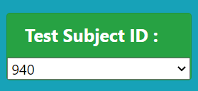
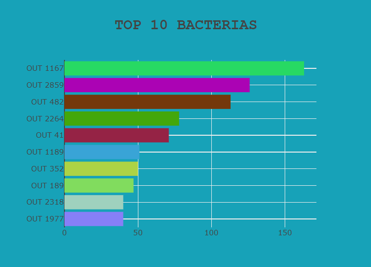
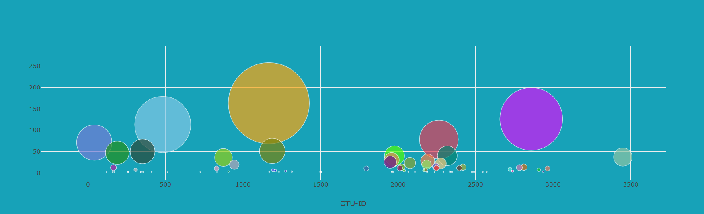
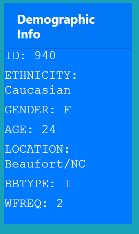
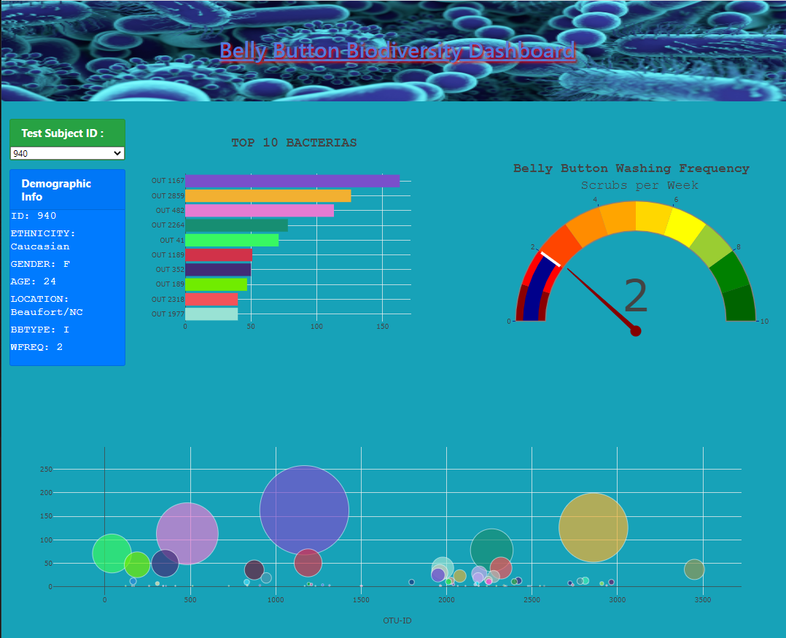
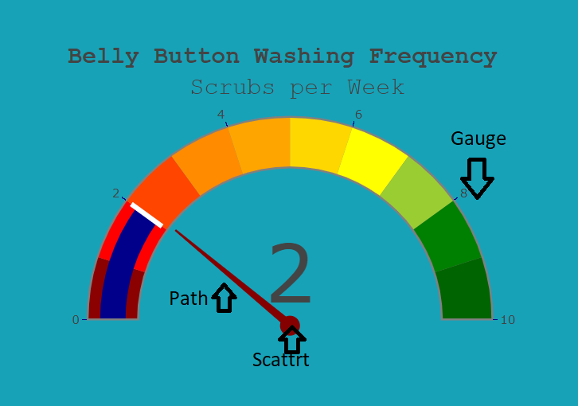

# Plot.ly Homework - Belly Button Biodiversity

In this project, We will build an interactive dashboard to explore the [Belly Button Biodiversity dataset](http://robdunnlab.com/projects/belly-button-biodiversity/), which catalogs the microbes that colonize human navels.

The dataset reveals that a small handful of microbial species (also called operational taxonomic units, or OTUs, in the study) were present in more than 70% of people, while the rest were relatively rare.

The Dashboard can be viewed [ https://nima-karimii.github.io/Plotly-JS-Challenge/] ( https://nima-karimii.github.io/Plotly-JS-Challenge/)

## Step 1: Plotly

1. I Used the D3 library to read in `samples.json`.

2. I created a horizontal bar chart with a dropdown menu to display the top 10 OTUs found in that individual.

3. I create a bubble chart that displays each sample.

4. I displayed the sample metadata, i.e., an individual's demographic information on the page

6.The page will refresh all of the plots any time that a new sample is selected.

7.I adapt the Gauge Chart from <https://plot.ly/javascript/gauge-charts/> to plot the weekly washing frequency of the individual. I used 3 plots from Plotly to show this gauge with arrow ; "Gauge", "Path" and "Scater".

### Hope you enjoy it.

### About the Data

Hulcr, J. et al.(2012) _A Jungle in There: Bacteria in Belly Buttons are Highly Diverse, but Predictable_. Retrieved from: [http://robdunnlab.com/projects/belly-button-biodiversity/results-and-data/](http://robdunnlab.com/projects/belly-button-biodiversity/results-and-data/)

- - -

© 2019 Trilogy Education Services
